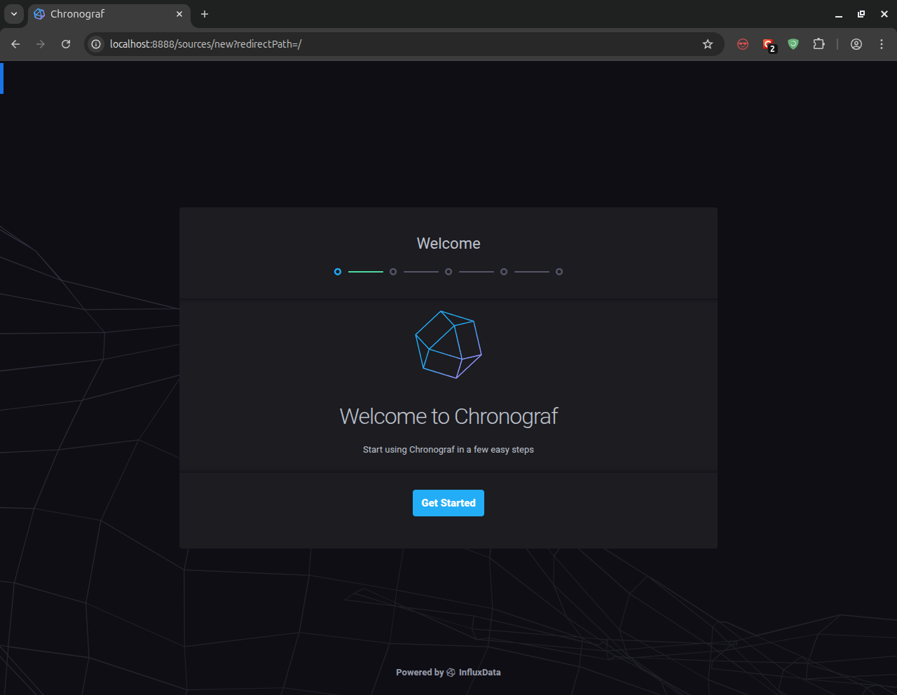
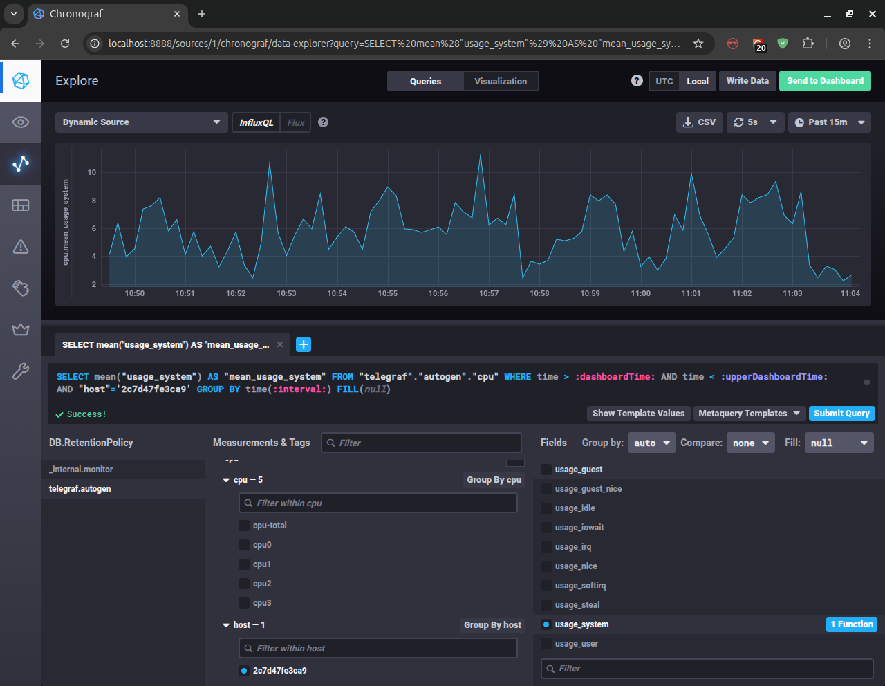

## Задание 1

1. CPU Utilization
   Почему: вычисления грузят CPU — это главный ресурс платформы.
   Что важно вывести:

* общая загрузка CPU
* load average
* steal time (если виртуализация)
* saturation (run queue length)

Это позволит понять, когда система перестаёт успевать обрабатывать задачи.

1. Disk Usage
   Платформа сохраняет текстовые отчёты на диск.

Минимум:

* свободное место на диске
* inode usage
* скорость записи/чтения (iowait)

Почему: если диск заполнится — система перестанет работать, отчёты не сохранятся, API начнёт отдавать ошибки.

1. HTTP Availability
   Платформа работает по HTTP → это основной интерфейс.

Минимум:

* количество запросов
* latency (p50/p95/p99)
* HTTP‑коды (2xx/4xx/5xx)

Почему: это единственный способ понять, что пользователи реально получают ответы, а не ошибки.

1. Application Errors
   Даже если CPU и диск в норме, приложение может падать.

Минимум:

* количество ошибок в логах (error rate)
* количество failed jobs / failed computations

Почему: вычисления могут завершаться ошибкой, но система при этом будет «жива».

1. Queue Length / Pending Jobs
   Если вычисления тяжёлые, они либо:

выполняются параллельно, либо ставятся в очередь.

Минимум:

* длина очереди
* время ожидания задачи

Почему: это ранний индикатор деградации — очередь растёт раньше, чем CPU уходит в 100%.
Почему именно эти метрики — минимальный набор
Потому что они закрывают три ключевых вопроса:

1) Работает ли API?
   → HTTP latency, HTTP codes
2) Может ли система выполнять вычисления?
   → CPU load, queue length, error rate
3) Может ли система сохранять результаты?
   → Disk usage, iowait

Если эти метрики в порядке — система почти гарантированно работает.

## Задание 2

Менеджеру не нужны технические метрики — ему нужны бизнес‑метрики уровня SLO/SLA/SLI, которые показывают качество сервиса глазами клиента.
Технические метрики (CPU, RAM, inode) — это для инженеров.
Менеджеру нужны показатели, которые отвечают на вопросы:
«Сервис работает? Насколько хорошо? Успеваем ли мы обслуживать клиентов?»

1) Переход от технических метрик к SLI/SLO/SLA
   Что такое SLI — измеримый показатель качества сервиса.
   Примеры: процент успешных HTTP‑запросов, время генерации отчёта, доля задач, завершившихся успешно

Что такое SLO:
SLO — целевое значение SLI.
Например:

99% запросов должны завершаться за < 1 секунды

95% отчётов должны генерироваться < 30 секунд

Что такое SLA:
SLA — юридическое обещание клиенту. Обычно строже и реже меняется.

1) Какие SLI/SLO предложить для вашей платформы
   Платформа делает вычисления и отдаёт отчёты → значит, есть два ключевых бизнес‑процесса:

A) Доступность API (HTTP)
SLI:

* процент успешных запросов (2xx)
* процент ошибок сервера (5xx)
* медиана/95‑й перцентиль задержки ответа

SLO:

* 99% запросов успешны
* 95% запросов быстрее 500 мс

Почему: это отражает, насколько клиенты могут пользоваться платформой.

B) Качество выполнения вычислений
SLI:

* процент успешно завершённых вычислений
* среднее/95‑й перцентиль времени генерации отчёта
* процент задач, завершившихся ошибкой

SLO:

* 98% вычислений завершаются успешно
* 90% отчётов генерируются < 30 секунд

Почему: это напрямую показывает, насколько хорошо сервис выполняет свою основную функцию.

C) Скорость доставки результата клиенту
SLI:

* время от получения запроса до сохранения отчёта
* процент отчётов, доступных клиенту в течение X секунд

SLO:

* 95% отчётов доступны < 10 секунд

Почему: это то, что клиент реально ощущает.

1) Как объяснить менеджеру, зачем нужны технические метрики
   Менеджеру не нужно знать, что такое CPU load или inode usage.
   Но ему важно понимать, как *технические метрики* влияют на *бизнес‑метрики*.

Пример объяснения:

* CPU 100% → вычисления выполняются медленнее → SLO по времени отчёта нарушается
* Диск заполнен → отчёты не сохраняются → SLI «успешные вычисления» падает

RAM закончилась → сервис падает → SLI «доступность API» падает

То есть технические метрики — это инструменты для инженеров, чтобы держать SLO.

1) Что показать менеджеру в дашборде

1. Уровень доступности сервиса

* % успешных запросов
* % ошибок
* задержки p50/p95/p99

1. Качество выполнения задач

* % ошибок
* % успешных вычислений
* время генерации отчётов

1. Выполнение SLO

* жёлтая — близко к нарушению
* красная — нарушили
* зелёная зона — выполняем

1. Error budget
   Показывает, сколько «ошибок» мы можем себе позволить, не нарушив SLO.

1) Что сказать менеджеру простыми словами
   «Мы будем показывать вам не CPU и RAM, а то, насколько хорошо мы выполняем обязательства перед клиентами:
   — насколько доступен сервис,
   — насколько быстро он отвечает,
   — насколько успешно выполняет вычисления,
   — и выполняем ли мы наши SLO.
   Технические метрики остаются для инженеров, чтобы поддерживать эти показатели.»

## Задание 3

Варианты решений:

1. Централизованное логирование через syslog — настроить отправку логов приложений в системный журнал, который уже есть в ОС.
2. ELK Stack в минимальном режиме — запустить только Elasticsearch и Kibana на одном сервере, без Logstash. Приложения пишут логи в файлы, которые читает Filebeat.
3. Graylog Community Edition — бесплатная версия с базовыми возможностями.
4. Сбор логов в файлы + веб‑интерфейс — скрипты собирают логи в централизованное хранилище, простой веб‑интерфейс для просмотра.
5. Использование встроенных возможностей приложений — многие фреймворки имеют встроенные механизмы логирования, которые можно настроить на запись в общий файл.

## Задание 4

Короткий вывод: формула неверная, потому что SLA расчитывается только по 2xx, а остальные успешные ответы (например 3xx) не учитываются.
В результате доля 2xx от всех запросов ≈ 70%, хотя ошибок нет.

Где именно ошибка в расчете SLA:

```
𝑆𝐿𝐴 = кол-во 2xx / все запросы
```

Но в HTTP есть не только 2xx и ошибки.
Есть ещё 3xx — редиректы, которые не являются ошибками.

Если на примере:

* 70% запросов → 2xx
* 30% запросов → 3xx
* 0% → 4xx
* 0% → 5xx

То формула даст SLA = 70%, хотя все 100% запросов успешные.

Как правильно считать SLA

Правильный SLI доступности:

```
𝑆𝐿𝐴 = успешные ответы / все ответы
```

Где успешные:

* 2xx — успешный ответ
* 3xx — успешный редирект

Ошибки:

* 4xx — клиентские ошибки
* 5xx — серверные ошибки

Менеджер и клиенты смотрят на доступность сервиса глазами пользователя.
Пользователь не видит разницы между 200 OK и 302 Redirect — оба считаются успешными. Поэтому правильным будет расчитывать так:

```
𝑆𝐿𝐴 = summ_2xx_requests + summ_3xx_requests / 𝑠𝑢𝑚𝑚_𝑎𝑙𝑙_𝑟𝑒𝑞𝑢𝑒𝑠𝑡𝑠
```

## Задание 5

> Короткий вывод: pull и push — это два разных способа доставки метрик, и у каждого есть сильные и слабые стороны.

#### Pull‑модель (Prometheus‑style)

Плюсы:

* Простая архитектура — один Prometheus опрашивает множество таргетов.
* Автоматическое обнаружение (service discovery) — удобно в Kubernetes, Consul, EC2.
* Контроль частоты опроса — сервер сам решает, как часто собирать метрики.
* Безопаснее с точки зрения сети — инициатор соединения — мониторинг, а не приложение.
* Легче дебажить — можно открыть /metrics в браузере и увидеть всё.
* Нет нагрузки на приложение — приложение просто отдаёт метрики, не пушит их.

Минусы:

* Нужна доступность таргетов — мониторинг должен достучаться до каждого сервиса.
* Проблемы с NAT/файрволами — сложно собирать метрики с edge‑нод, IoT, внешних сервисов.
* Не подходит для краткоживущих задач — Prometheus может не успеть опросить job, которая живёт 5 секунд.
* Сложнее масштабировать — много таргетов → много соединений → нагрузка на Prometheus.

#### Push‑модель (Pushgateway, StatsD, VictoriaMetrics, Graphite‑style)

Плюсы:

* Работает за NAT/файрволами — приложение само отправляет метрики наружу.
* Подходит для краткоживущих задач — job завершилась → отправила метрики → умерла.
* Меньше требований к мониторингу — нет необходимости опрашивать тысячи таргетов.
* Гибкость в отправке — можно пушить события, счётчики, ошибки, heartbeat.

Минусы:

* Сложнее обеспечить доверие к данным — приложение может «замолчать», и мониторинг об этом не узнает.
* Нагрузка на приложение — оно само отправляет метрики.
* Нет единого стандарта — разные форматы, протоколы, агенты.
* Сложнее дебажить — нельзя просто открыть /metrics.
* Pushgateway не предназначен для долговременных метрик — легко использовать неправильно.

> Pull — стандарт для сервисов.
> Push — стандарт для задач и нестандартных окружений.

## Задание 6

> Pull vs Push: классификация систем

---

**Pull‑модель**

Сервер мониторинга сам опрашивает таргеты.

1. Prometheus — pull, по умолчанию использует `pull‑модель`:

* опрашивает /metrics
* использует service discovery
* push возможен только через Pushgateway (это костыль, а не основная модель)

2. Zabbix — pull + push (гибридная система):

* Zabbix server → pull с Zabbix agent (active/passive)
* Zabbix agent → push в active‑режиме
* Zabbix sender → push
* Trapper items → push

3. Nagios — pull + push (гибрид)
   Nagios Core исторически pull:

* сервер запускает плагины и опрашивает хосты
  Но:
* NRDP/NSCA позволяют push
* NRPE — удалённый агент, но всё равно инициатор — сервер
  Итого: гибрид, но доминирует pull.

---

**Push‑модель**

Таргеты отправляют метрики сами.

4. TICK (Telegraf + InfluxDB + Chronograf + Kapacitor) — push
   TICK‑стек — классическая push‑модель:

* Telegraf → push в InfluxDB
* Нет pull‑механизма
* Подходит для edge‑нод, IoT, NAT

5. VictoriaMetrics — push + pull (гибрид)
   VictoriaMetrics поддерживает оба варианта:

* pull: совместима с Prometheus scrape
* push: принимает данные по:
  * Influx line protocol
  * Graphite
  * OpenTSDB
  * Prometheus remote_write

Это одна из самых гибких систем.

**Итоговая таблица**


| Система               | Модель | Комментарий                                        |
| ------------------------------ | -------------- | --------------------------------------------------------------- |
| **Prometheus**               | pull         | Push только через Pushgateway                      |
| **TICK (Telegraf/InfluxDB)** | push         | Чистый push‑pipeline                                   |
| **Zabbix**                   | гибрид | Active agent + sender = push; passive agent = pull            |
| **VictoriaMetrics**          | гибрид | Поддерживает и pull, и push                     |
| **Nagios**                   | гибрид | Основной pull, но есть push‑механизмы |

## Задание 7

Скриншот веб‑интерфейса Chronograf 

## Задание 8

Скриншот с отображением метрик утилизации CPU из веб‑интерфейса )

